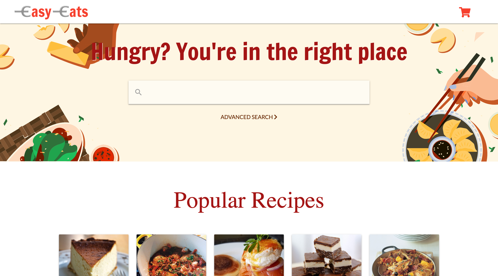
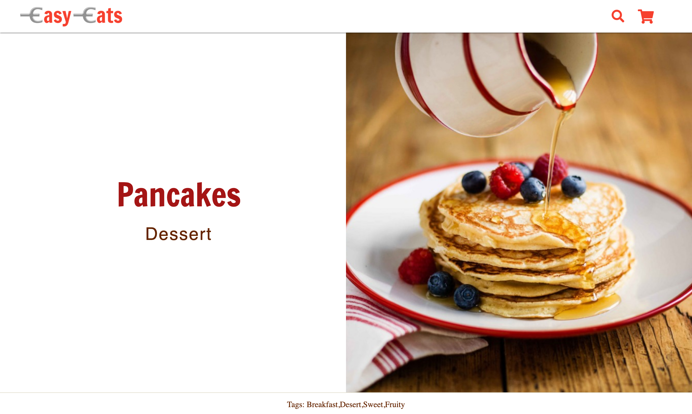

<a href="https://choosealicense.com/licenses/mit" target="_blank"></a>

# Easy-Eats-Angular

## Table of Contents:
1. [Link](#link)
1. [Description](#description)
1. [Preview](#preview)
1. [User Story](#user-story)
1. [Acceptance Criteria](#acceptance-criteria)
1. [Future Goals](#future-goals)
1. [Technologies](#technologies)

## Link
Link to site: https://easy-eats-angular.netlify.app/

## Description
<b>Easy Eats</b> is a recipe website for a busy individual who enjoys cooking. It is sometimes difficult to find a website that has both the recipes and ingredients needed, which can be exhausting. Easy Eats allows for a more enjoyable experience in learning new recipes by allowing users to find recipes and order the ingredients in one spot.

## Preview
### Homepage


### Recipe Page


## User Story
```
AS A busy individual
I WANT easy access to recipes and ingredients that will be delivered to my doorstep
SO THAT I don’t have to worry about traveling to buy the ingredients
```

## Acceptance Criteria
```
GIVEN a recipe site
WHEN I visit the site for the first time
THEN I am presented with the homepage, which includes a search bar, popular posts, and a subscription section
WHEN I search an ingredient on the search bar
THEN I am sent to a page that shows the total number of recipes and all the recipes associated with my search
WHEN I click on a recipe
THEN I am presented with the recipes information, including the name, category, tags, ingredients, add to cart button, instructions, video, subcription section, and recommended recipes
WHEN I click on the add to cart button
THEN I am shown a modal with an ingredient name, all the different types of the ingredient, a search bar, and the next button
WHEN I click the next button on the modal
THEN I am taken to the next ingredient until I have gone through all the ingredients
WHEN I am on the last page of the modal
THEN I am presented with my final ingredients and the done button
WHEN I click on the done button
THEN I am taken back to the recipe page and all my ingredients are added to the cart
WHEN I click on the cart button in the navigation bar
THEN I am presented with my recipes, ingredients chosen in the recipe cart, total cost, and the proceed to checkout button
```

## Future Goals
- Change to Angular materialize
- Add backend (login, favorites, cart)

## Technologies
### Front End
&nbsp; &nbsp;
&nbsp; &nbsp;
&nbsp; &nbsp; &nbsp; 
&nbsp; &nbsp; &nbsp; 
&nbsp; &nbsp; &nbsp; 